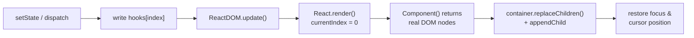

# vanilla-react-typescript

A from-scratch reimplementation of React's core — written in plain TypeScript, with **no React dependency** — built to research one question:

> **How do React hooks actually work, and how can a plain function like `useState` remember its value between renders?**

The answer is **closures**. This repo implements `useState`, `useReducer`, `useEffect`, and a minimal `ReactDOM` on top of that idea, then uses them to build a real little app (client-side routing, plus a product search driven by a state machine against a public API) so the implementation is exercised by something more than a counter.

The only runtime dependency is `express`, and it exists purely to serve the built files.

---

## The idea in one page

Both `React` and `ReactDOM` are **IIFEs** — functions that run once and return an object. The variables declared inside them are never exposed; the returned methods close over them. That private, persistent scope is the entire trick.

```ts
export const React = (function () {
  let hooks = [];        // survives every render
  let currentIndex = 0;  // reset at the start of each render
  return { render, useState, useReducer, useEffect };
})();
```

**`hooks` is the memory. `currentIndex` is the cursor.**

1. `React.render()` sets `currentIndex = 0` and calls your component function.
2. Each hook call reads slot `hooks[currentIndex]`, then advances the cursor.
3. Because the cursor resets to `0` every render and your component calls its hooks in the same order every time, **hook #2 always lands on slot #2** — that is how a hook finds its own value again, and why the Rules of Hooks exist. Put a hook behind an `if` and the cursor drifts, and every hook after it reads someone else's state.

`useState` then captures its own slot number in a second closure:

```ts
useState<T>(initialValue: T) {
  const useStateIndex = currentIndex; // captured — this setter's private address
  currentIndex++;
  hooks[useStateIndex] = hooks[useStateIndex] ?? initialValue;

  const setState = (newVal: T) => {
    hooks[useStateIndex] = /* ... */; // still writes to the right slot, renders later
    ReactDOM.update();
  };

  return [hooks[useStateIndex], setState];
}
```

The setter outlives the render that created it. When a click handler fires it three renders later, `useStateIndex` is still baked into it.

`ReactDOM` uses the same technique for a different job — it remembers the container and the root component, so any `setState` anywhere in the tree can re-render the whole app without being handed those arguments again:

```ts
export const ReactDOM = (function () {
  let _container: HTMLElement;
  let _Component: () => HTMLElement;
  return {
    update() { this.render(_container, _Component); }, // no args needed
    render(container, Component) { _container = container; _Component = Component; /* ... */ },
  };
})();
```

### The render cycle



There is **no virtual DOM and no diffing here**. Components are plain functions that return real `HTMLElement`s, and every update throws the old tree away and rebuilds it. That is what makes the implementation small enough to read in one sitting — and it has a visible cost: the focused element is destroyed on every keystroke, so `ReactDOM.render` manually saves `document.activeElement.id` plus `selectionStart` / `selectionEnd` and restores them afterwards. (That is also why the search `<input>` carries a hardcoded `id`.)

---

## Where to look

**Start here — this is the file the repo exists for:**

| File | What's in it |
| --- | --- |
| **[`src/client/React.ts`](src/client/React.ts)** | **The whole implementation.** `ReactDOM` (render, focus restoration, `update`) and `React` (`render`, `useState`, `useReducer`, `useEffect`) — under 100 lines. |

Then, in the order that makes the implementation click:

| File | Why read it |
| --- | --- |
| [`src/client/index.ts`](src/client/index.ts) | The entry point — 5 lines. Grabs `#root` and calls `ReactDOM.render(root, App)`. |
| [`src/client/App.ts`](src/client/App.ts) | `useState` + `useEffect` in practice. State holds `pathname`; the effect calls `history.pushState`. This is the whole router. |
| [`src/client/components/Link.ts`](src/client/components/Link.ts) | The smallest possible component: props in, a real `<a>` element out. No JSX, no elements-as-objects. |
| [`src/client/components/Navbar.ts`](src/client/components/Navbar.ts) | Composition — a component calling other components and appending their nodes. |
| [`src/client/screens/HomePage/index.ts`](src/client/screens/HomePage/index.ts) | The most substantial example: `useReducer` driving a tagged state machine (`idle → loading → loaded / empty / error`), one `useEffect` persisting the query to `localStorage`, another performing the fetch. |
| [`src/client/screens/HomePage/ProductSearchInput.ts`](src/client/screens/HomePage/ProductSearchInput.ts) | A controlled input against a DOM that gets rebuilt on every keystroke — the counterpart to the focus-restoration code in `React.ts`. |
| [`src/client/screens/HomePage/ProductList.ts`](src/client/screens/HomePage/ProductList.ts) · [`ProductItem.ts`](src/client/screens/HomePage/ProductItem.ts) | Rendering a list, and branching on the state machine's tag. |
| [`src/client/screens/AboutPage/index.ts`](src/client/screens/AboutPage/index.ts) | The second route. Deliberately hook-free. |
| [`src/server/index.ts`](src/server/index.ts) | 14 lines of Express: serve `dist/public`, fall back to `index.html` so client-side routes survive a refresh. |
| [`webpack.config.client.js`](webpack.config.client.js) · [`webpack.config.server.js`](webpack.config.server.js) | Two bundles from one `tsc` output: the browser bundle (+ generated HTML) and the Node server bundle. |

One detail worth noticing in [`App.ts`](src/client/App.ts): **both** `HomePage(...)` and `AboutPage(...)` are called on every render, before the `pathname` check decides which node to return. With a single shared `hooks` array, that is what keeps the hook order — and therefore every slot index — stable across route changes.

---

## Running it

Requires Node.js and npm (verified on Node v22 / npm v10).

```bash
git clone https://github.com/mnindrazaka/vanilla-react-typescript.git
cd vanilla-react-typescript
npm install
npm start
```

Then open **http://localhost:3000** — try `/home` and `/about`, and refresh on either to see the server-side fallback do its job. The product search calls the public [dummyjson.com](https://dummyjson.com) API, so that part needs an internet connection.

### Scripts

| Command | What it does |
| --- | --- |
| `npm start` | Full build, then `node dist/server.js` on port 3000. |
| `npm run build` | `build:ts` → `build:webpack:client` → `build:webpack:server`. |
| `npm run build:ts` | `tsc` compiles `src/**/*` to ES5 in `dist-js/`. |
| `npm run build:webpack:client` | Bundles `dist-js/client` → `dist/public/index.js`, generating `dist/public/index.html` from [`public/index.html`](public/index.html). |
| `npm run build:webpack:server` | Bundles `dist-js/server` → `dist/server.js`. |

There is no watch mode — after editing anything under `src/`, re-run `npm start`.

Build output (`dist-js/`, `dist/`) is git-ignored. Webpack prints two warnings on build — a `mode` default and an Express dynamic-require notice — both are expected and harmless.

---

## Known limits

These are deliberate: the goal was a readable explanation of hooks, not a React replacement.

- **One shared `hooks` array for the entire tree.** Real React keeps a hooks list per fiber; here every component draws from the same array, so state is positional across the whole app rather than owned by a component instance.
- **No cleanup functions.** `useEffect` ignores anything the callback returns, so there is no unsubscribe/teardown phase.
- **No batching.** Every `setState` / `dispatch` synchronously re-renders the entire tree.
- **No reconciliation.** The DOM is discarded and rebuilt each update; focus and cursor position are patched back by hand.
- **Only three hooks.** `useState`, `useReducer`, `useEffect`. `useMemo`, `useCallback`, `useRef`, and context are left as an exercise — the slot mechanism in `React.ts` is all you need to add them.
